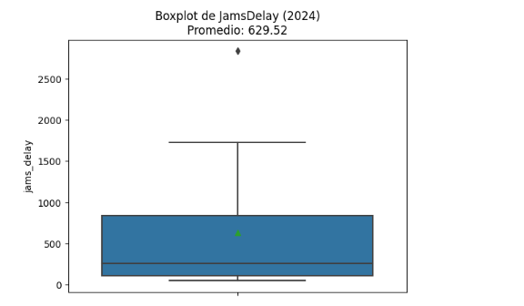
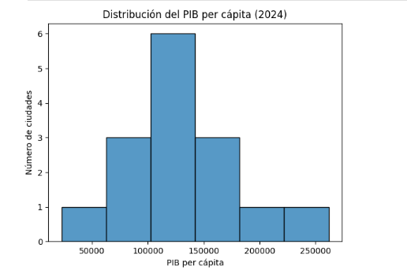
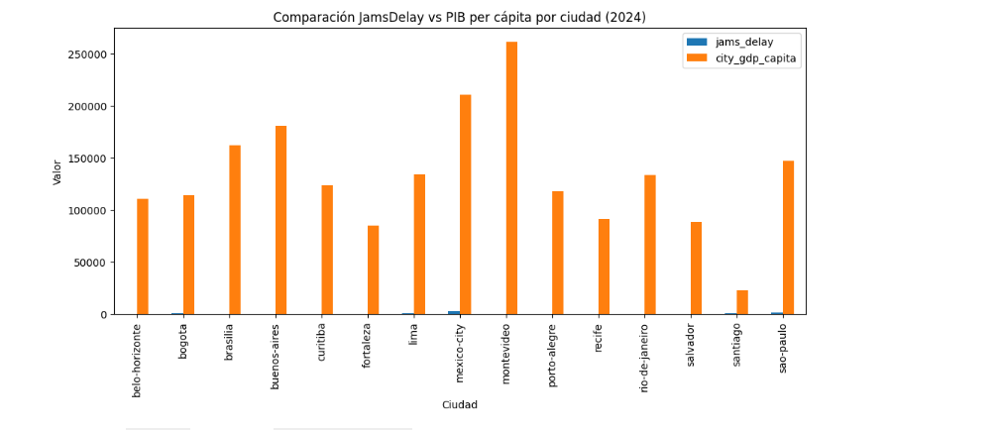

# Movilidad Urbana y Economía en LATAM – Python

## Descripción del Proyecto

Como analista de datos, el objetivo de este proyecto es evaluar cómo la movilidad urbana se relaciona con la productividad económica en las principales ciudades latinoamericanas.

Se trabajó con datos reales de **TomTom Traffic Index** y **OECD Cities** del año 2024, que fueron limpiados, combinados y analizados para identificar en qué ciudades conviene invertir en infraestructura de transporte.

Este análisis fue desarrollado como parte del programa de **Analista de Datos de TripleTen**.

---

## Objetivo

Identificar si las ciudades con mayor congestión vehicular también presentan menor productividad económica, para apoyar decisiones estratégicas de inversión en transporte urbano.

---

## Dataset

| Archivo | Descripción |
|---|---|
| `tomtom_traffic.csv` | Datos de tráfico y congestión vehicular por ciudad (TomTom Traffic Index) |
| `oecd_city_economy.csv` | Datos económicos por ciudad: PIB per cápita, desempleo, población (OECD Cities) |

### Columnas principales — `tomtom_traffic`

| Columna | Descripción |
|---|---|
| `country` | País de la ciudad |
| `city` | Nombre de la ciudad |
| `jams_delay` | Retraso promedio por congestión (en minutos acumulados) |
| `jams_count` | Número de embotellamientos registrados |
| `traffic_index_live` | Índice de tráfico en tiempo real |
| `travel_time_live_per_10kms_mins` | Tiempo de viaje por cada 10 km (en minutos) |

### Columnas principales — `oecd_city_economy`

| Columna | Descripción |
|---|---|
| `city` | Nombre de la ciudad |
| `country` | País |
| `city_gdp_capita` | PIB per cápita de la ciudad |
| `unemployment_pct` | Tasa de desempleo (%) |
| `population_m` | Población en millones |

---

## Proceso de Análisis

### Paso 1 – Carga y exploración de datos
- Importación de librerías: `pandas`, `numpy`, `seaborn`, `matplotlib`
- Carga de los archivos CSV en DataFrames `traffic` y `eco`
- Vista previa de los primeros registros y estructura de columnas con `.info()`

### Paso 2 – Limpieza y preparación
- **Problemas detectados en `eco`:** columnas como `city_gdp_capita`, `unemployment_pct`, `pm25` y `population_m` eran de tipo `object` por contener comas, puntos y símbolos como `%`
- **Soluciones aplicadas:**
  - Estandarización de nombres a `snake_case` con `.rename()`
  - Conversión de columnas de fecha a `datetime` con `pd.to_datetime(errors='coerce')`
  - Limpieza de separadores de miles y reemplazo de comas por puntos antes de convertir a `float`
  - Creación de columna `population` multiplicando `population_m * 1,000,000`

### Paso 3 – Extracción de año y filtrado 2024
- Extracción del año desde la columna de fecha con `.dt.year`
- Filtrado de registros del año 2024 usando `.copy()` para evitar modificar el original

### Paso 4 – Resumen de tráfico por ciudad
- Agrupación por `city`, `country`, `year`
- Cálculo de promedios de métricas clave con `.agg()` y `.mean()`
- Resultado guardado en `traffic_city_year_2024`

### Paso 5 – Unión de datasets
- Selección de columnas relevantes de cada dataset
- Join de tipo `inner` usando `city` y `year` como claves
- Resultado guardado en `merged` (15 ciudades latinoamericanas)

### Paso 6 – Visualización y análisis
- **Boxplot** de `jams_delay` para detectar distribución y valores atípicos
- **Histograma** de `city_gdp_capita` para analizar la distribución económica
- **Gráfico de barras** comparando `jams_delay` vs `city_gdp_capita` por ciudad

---

## Principales Hallazgos

- 🏙️ **Ciudad de México** presentó el mayor nivel de congestión con un `jams_delay` promedio de **2,833**, superando a Tokyo (2,152) y New York (2,133)
- 📉 Las ciudades latinoamericanas con mayor congestión tienden a tener un **PIB per cápita más bajo**, lo que sugiere que el tráfico afecta negativamente la economía
- 🔴 **Bogotá** y **Ciudad de México** son las ciudades más prioritarias para invertir en infraestructura de transporte: combinan alta congestión con bajo PIB per cápita
- 📊 Buenos Aires tiene mayor PIB per cápita que Bogotá con nivel similar de tráfico, lo que refuerza la relación inversa entre congestión y productividad

---

## Preguntas de Negocio Respondidas

| Pregunta | Hallazgo |
|---|---|
| ¿Qué ciudad tiene mayor congestión en LATAM? | Ciudad de México (jams_delay: 2,833) |
| ¿Las ciudades más congestionadas tienen menor PIB? | Sí, la tendencia muestra esa relación inversa |
| ¿Qué ciudades priorizar para inversión en transporte? | Ciudad de México y Bogotá |

---

## Estructura del Proyecto

```
analisis-limpieza-datos-python/
│
├── README.md
└── 55_ladb_mobility_economy_project_student.ipynb
```

---

## Herramientas Utilizadas

- Python 3
- Pandas
- NumPy
- Matplotlib
- Seaborn
- Jupyter Notebook

---
## Visualizaciones

### Boxplot – Distribución de JamsDelay


### Histograma – PIB per cápita


### Comparación JamsDelay vs PIB por ciudad


## Autor

**Stiven Lizarazo**  
Analista de Datos Junior  
Proyecto desarrollado como parte del programa de Análisis de Datos de TripleTen.
